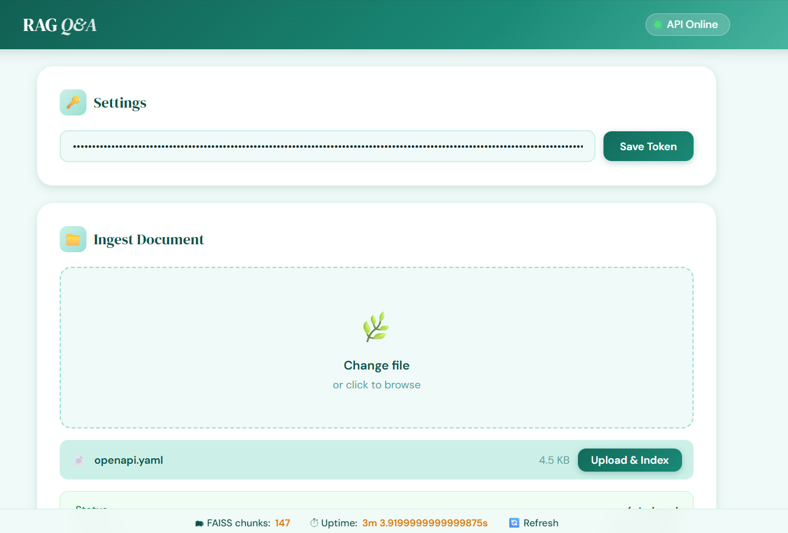
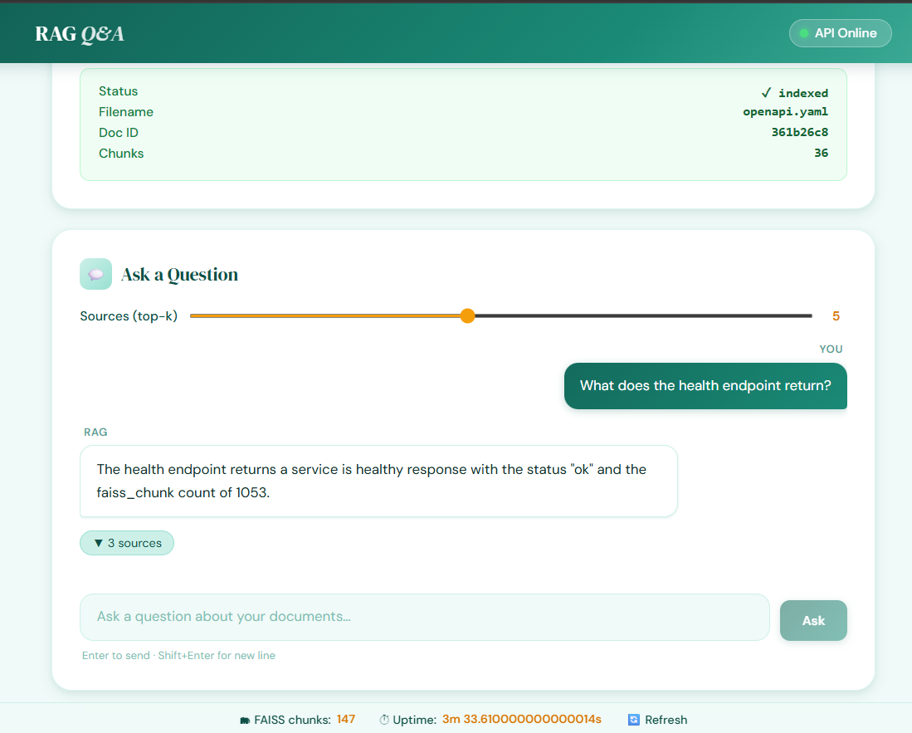

# RAG Document Q&A System

> Upload any document. Ask anything. Get cited answers powered 100% locally. No API keys, no cloud, no cost.


A production grade **Retrieval-Augmented Generation (RAG)** system that runs entirely on your machine. Upload PDFs, Word docs, CSVs, or any text file then ask questions in plain English and get accurate, sourced answers powered by a local LLM.

No OpenAI. No Gemini. No subscriptions. Everything runs offline.

Why I Built This

Most RAG tutorials rely on paid APIs like OpenAI or Gemini which means your private documents get sent to third-party servers, and every query costs money. I wanted to build a production-grade RAG system that runs entirely on your own machine: no subscriptions, no data leaving your device, no vendor lock-in. This project proves that with the right open-source tools (Ollama + FAISS + Flask), you can build enterprise quality document Q&A that anyone can run for free.


---

## Screenshots


---

## What is RAG and Why Does It Matter?

Large Language Models (LLMs) are powerful but have two problems:
1. They don't know your private documents
2. They hallucinate making up facts confidently

RAG fixes both. Instead of asking the LLM to recall facts from training, we:
1. **Retrieve** the most relevant chunks from your documents using vector search
2. **Augment** the prompt with those chunks as context
3. **Generate** an answer grounded in real source text

The result: accurate, cited answers from your own documents.

---

## Architecture

```
┌─────────────┐     ┌──────────┐     ┌─────────────┐     ┌──────────────────┐
│  Document   │────▶│  Loader  │────▶│   Chunker   │────▶│    Embedder      │
│ (PDF/DOCX/  │     │          │     │ (512 chars, │     │ nomic embed text │
│  TXT/HTML)  │     │          │     │  64 overlap)│     │ via Ollama       │
└─────────────┘     └──────────┘     └─────────────┘     └───────┬──────────┘
                                                                   │
                                                          ┌────────▼────────┐
                                                          │  FAISS Index +  │
                                                          │ Metadata Store  │
                                                          └────────┬────────┘
                                                                   │
┌─────────────┐     ┌──────────┐     ┌─────────────┐     ┌────────▼────────┐
│   Answer +  │◀────│tinyllama │◀────│   Prompt    │◀────│   Retriever     │
│   Sources   │     │via Ollama│     │   Builder   │     │  (MMR rerank,   │
│             │     │localhost │     │             │     │   top-k=3)      │
└─────────────┘     └──────────┘     └─────────────┘     └─────────────────┘
```

**Ingest flow:** Document → split into overlapping chunks → embed each chunk → store vectors in FAISS

**Query flow:** Question → embed → find nearest chunks → build prompt → LLM generates cited answer

---

## Tech Stack & Why We Chose It

| Component | Technology | Why This, Not That |
|---|---|---|
| **LLM** | Ollama (tinyllama / phi3:mini) | Runs locally no API costs, no data leaving your machine. OpenAI/Gemini require subscriptions and send your data to the cloud. |
| **Embeddings** | nomic embed text via Ollama | Free, local, high quality. Comparable to OpenAI embeddings but zero cost and fully offline. |
| **Vector Store** | FAISS | Facebook's battle tested library. Sub millisecond search on millions of vectors. No database server needed just files on disk. Pinecone/Weaviate require hosted infrastructure. |
| **Backend** | Flask | Lightweight, simple REST API. FastAPI would work too, but Flask has less overhead for this use case. |
| **Auth** | JWT (PyJWT) | Stateless no session store needed. Tokens are signed and verified locally. |
| **Frontend** | React | Clean UI for non technical users to upload docs and ask questions without touching the API directly. |

---

## Features

| Feature | Details |
|---|---|
| **Multi-format ingestion** | PDF, DOCX, TXT, HTML, CSV |
| **FAISS vector search** | Sub-second L2 search with MMR reranking |
| **Local embeddings** | `nomic-embed-text` no cloud calls |
| **Local LLM** | `tinyllama` or `phi3:mini` runs on CPU |
| **Source attribution** | Every answer cites the source chunk and relevance score |
| **JWT authentication** | Stateless token auth on all routes |
| **Rate limiting** | Token-bucket per IP limiter |
| **Observability** | structlog JSON logging + Prometheus metrics |
| **Docker ready** | Single `docker compose up` deployment |

---

## Quick Start

### Prerequisites

- Python 3.11+
- [Ollama](https://ollama.com) installed and running
- Node.js (only for the React frontend)

### 1. Install Ollama & Pull Models

```bash
ollama pull nomic-embed-text   # embeddings
ollama pull tinyllama          # LLM (fast, CPU-only)
```

Want better quality answers? Use phi3:mini instead:
```bash
ollama pull phi3:mini
# Then update ollama_llm_model in app/core/config.py
```

### 2. Clone & Configure

```bash
git clone https://github.com/DonaRashmitha-dev/rag-document-QA.git
cd rag-document-QA
cp .env.example .env
```

Set your JWT secret in `.env`:
```env
JWT_SECRET=any-random-string-you-choose
```

### 3. Install & Run Backend

```bash
pip install -e ".[dev]"
flask --app app:create_app run --port 8000
```

Verify:
```bash
curl http://localhost:8000/health
# {"faiss_chunks": 0, "status": "ok", "uptime_s": 1.2}
```

### 4. Run Frontend (Optional)

```bash
cd rag-frontend
npm install
npm start
# Opens http://localhost:3000
```

### 5. Docker (All-in-one)

```bash
docker compose up --build
```

---

## Getting a JWT Token

All routes except `/health` require a Bearer token. Generate one:

```bash
python -c "
import jwt
from datetime import datetime, timedelta, timezone
payload = {
    'sub': 'rag-qa-client',
    'iat': datetime.now(timezone.utc),
    'exp': datetime.now(timezone.utc) + timedelta(hours=24)
}
print(jwt.encode(payload, 'your-jwt-secret', algorithm='HS256'))
"
```

Use it as: `Authorization: Bearer <token>`

---

## API Usage

### Ingest a Document

```bash
curl -X POST http://localhost:8000/ingest \
  -H "Authorization: Bearer <token>" \
  -F "file=@document.pdf"
```

**Response:**
```json
{"status": "indexed", "filename": "document.pdf", "doc_id": "a1b2c3d4", "num_chunks": 42}
```

### Query

```bash
curl -X POST http://localhost:8000/query \
  -H "Authorization: Bearer <token>" \
  -H "Content-Type: application/json" \
  -d '{"query": "What is the refund policy?", "top_k": 5}'
```

**Response:**
```json
{
  "answer": "The refund policy allows returns within 30 days...",
  "sources": [
    {"chunk": "Returns are accepted within 30 days...", "score": 0.92, "source": "policy.pdf"}
  ]
}
```

### Health Check

```bash
curl http://localhost:8000/health
```

---

## Configuration

| Variable | Default | Description |
|---|---|---|
| `JWT_SECRET` | **required** | Secret string for signing tokens |
| `OLLAMA_BASE_URL` | `http://localhost:11434` | Ollama server URL |
| `OLLAMA_EMBED_MODEL` | `nomic-embed-text` | Embedding model |
| `OLLAMA_LLM_MODEL` | `tinyllama` | LLM for generation |
| `CHUNK_SIZE` | `512` | Characters per chunk |
| `CHUNK_OVERLAP` | `64` | Overlap between chunks |
| `TOP_K` | `5` | Chunks retrieved per query |
| `SCORE_THRESHOLD` | `0.7` | Minimum relevance score |
| `MAX_CONTEXT_TOKENS` | `12000` | Token budget for context |

---

## Running Tests

```bash
pytest tests/ -v --cov=app --cov-report=term-missing
```

---

## License

MIT free to use, modify, and distribute.

## Screenshots





